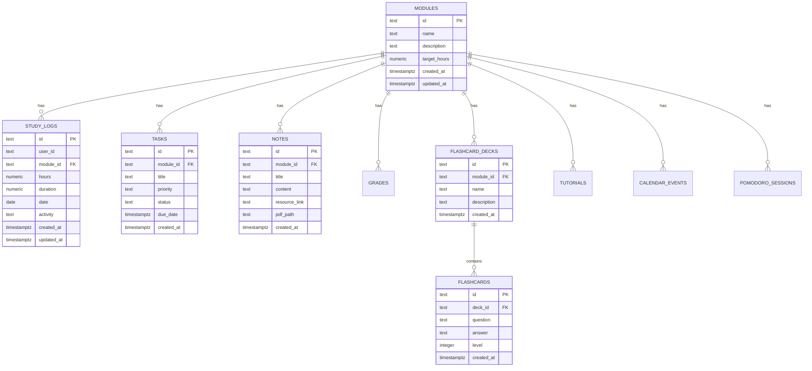

# Software Requirements Specification (SRS)

## StudySync — Academic Command Center

**Version:** 1.0  
**Date:** February 25, 2026  
**Author:** StudySync Development Team  
**Repository:** [github.com/monalisamaguruwada102-web/StudySync](https://github.com/monalisamaguruwada102-web/StudySync)

---

## 1. Introduction

### 1.1 Purpose
This Software Requirements Specification (SRS) documents the functional and non-functional requirements for **StudySync**, a comprehensive academic management platform designed to help university students organize, track, and optimize their study activities.

### 1.2 Scope
StudySync is a multi-platform application (Web, Desktop, Mobile) that provides module management, study logging, task tracking, note-taking, flashcard-based revision, real-time collaboration, analytics, gamification, and automated email engagement. The system integrates with Supabase for cloud persistence, Google Gemini AI for intelligent insights, and supports offline-first operation with automatic sync.

### 1.3 Definitions and Acronyms

| Term | Definition |
|------|-----------|
| **SRS** | Software Requirements Specification |
| **JWT** | JSON Web Token |
| **RLS** | Row-Level Security |
| **XP** | Experience Points |
| **CRUD** | Create, Read, Update, Delete |
| **SSR** | Server-Side Rendering |
| **CSP** | Content Security Policy |
| **SMTP** | Simple Mail Transfer Protocol |

### 1.4 Target Audience
- University/College students
- Academic advisors
- Study group coordinators
- Self-directed learners

---

## 2. Overall Description

### 2.1 Product Perspective
StudySync operates as a full-stack web application with optional Electron desktop packaging and a Flutter-based mobile companion app. It is deployed on Render (web) with a Supabase backend for data persistence, authentication, and real-time subscriptions.

### 2.2 Product Features (High-Level)

| Category | Features |
|----------|----------|
| **Academic Management** | Module tracking, Study logs, Grades, Tasks, Notes |
| **Study Tools** | Flashcards with spaced repetition, Video tutorials (YouTube integration), Deep Focus timer, Pomodoro timer |
| **Collaboration** | Real-time chat, Study groups, Resource sharing, Public viewer |
| **Analytics** | Dashboard charts, Deep analytics, Knowledge graph, Study streaks |
| **Engagement** | Gamification (XP, Levels, Badges), Automated emails, Push notifications |
| **Organization** | Calendar, Kanban board, SQL Visualizer |
| **Platform** | Web (React), Desktop (Electron), Mobile (Flutter) |

### 2.3 User Classes

| User Class | Description | Privileges |
|------------|-------------|------------|
| **Student** | Primary end-user | Full access to all features |
| **Guest** | Unauthenticated visitor | View public shared resources only |
| **System Admin** | Server operator | Database access, user management, email scheduling |

### 2.4 Operating Environment

| Component | Technology |
|-----------|-----------|
| **Client (Web)** | Modern browsers (Chrome, Firefox, Edge, Safari) |
| **Client (Desktop)** | Windows 10+ via Electron |
| **Client (Mobile)** | Android/iOS via Flutter |
| **Server** | Node.js 22+ on Render |
| **Database** | Supabase (PostgreSQL) |
| **File Storage** | Supabase Storage, MEGA Cloud (backup) |

### 2.5 Constraints
- Requires active internet connection for cloud sync (offline-first with local JSON fallback)
- YouTube embed requires valid video URLs
- Email services require SMTP credentials (Gmail)
- AI features require a Google Gemini API key

### 2.6 Assumptions and Dependencies
- Users have a valid email address for registration
- Supabase project is provisioned with the required schema
- The application is deployed behind HTTPS in production

---

## 3. Functional Requirements

### 3.1 Authentication System (FR-AUTH)

| ID | Requirement | Priority |
|----|-------------|----------|
| FR-AUTH-01 | Users shall register with email and password | High |
| FR-AUTH-02 | Passwords shall be hashed using bcrypt before storage | High |
| FR-AUTH-03 | Authentication shall use JWT tokens with configurable expiry | High |
| FR-AUTH-04 | The system shall support session persistence via HTTP-only cookies | High |
| FR-AUTH-05 | Protected routes shall redirect unauthenticated users to login | High |
| FR-AUTH-06 | Users shall be able to update their profile (name, email, password) | Medium |

### 3.2 Module Management (FR-MOD)

| ID | Requirement | Priority |
|----|-------------|----------|
| FR-MOD-01 | Users shall create, read, update, and delete academic modules | High |
| FR-MOD-02 | Each module shall have a name, description, and target study hours | High |
| FR-MOD-03 | Module detail view shall aggregate related study logs, tasks, notes, tutorials, and grades | High |
| FR-MOD-04 | Modules shall track progress percentage toward target hours | Medium |

### 3.3 Study Logging (FR-LOG)

| ID | Requirement | Priority |
|----|-------------|----------|
| FR-LOG-01 | Users shall log study sessions with module, hours, duration, date, and activity description | High |
| FR-LOG-02 | Study logs shall be exportable as CSV files | Medium |
| FR-LOG-03 | The system shall calculate total study hours, daily averages, and weekly trends | High |
| FR-LOG-04 | Study streaks shall be tracked (consecutive days of study) | Medium |

### 3.4 Task Management (FR-TASK)

| ID | Requirement | Priority |
|----|-------------|----------|
| FR-TASK-01 | Users shall create tasks with title, module, priority (Low/Medium/High), status, and due date | High |
| FR-TASK-02 | Tasks shall support status transitions: Pending → In Progress → Completed | High |
| FR-TASK-03 | A Kanban board view shall be available for visual task management | Medium |
| FR-TASK-04 | Overdue tasks shall be visually highlighted | Medium |

### 3.5 Notes System (FR-NOTE)

| ID | Requirement | Priority |
|----|-------------|----------|
| FR-NOTE-01 | Users shall create rich-text notes linked to modules | High |
| FR-NOTE-02 | Notes shall support resource links and PDF attachments | Medium |
| FR-NOTE-03 | Notes shall be shareable via public links | Medium |
| FR-NOTE-04 | Notes shall be shareable to in-app chat conversations | Medium |

### 3.6 Flashcard System (FR-FLASH)

| ID | Requirement | Priority |
|----|-------------|----------|
| FR-FLASH-01 | Users shall create flashcard decks linked to modules | High |
| FR-FLASH-02 | Each flashcard shall have a question and answer | High |
| FR-FLASH-03 | Flashcards shall support difficulty levels for spaced repetition | Medium |
| FR-FLASH-04 | A quiz mode shall test users on flashcard content | Medium |
| FR-FLASH-05 | Flashcard decks shall be shareable via public links | Medium |

### 3.7 Video Tutorials (FR-TUT)

| ID | Requirement | Priority |
|----|-------------|----------|
| FR-TUT-01 | Users shall add YouTube tutorials by URL with auto-extracted metadata | High |
| FR-TUT-02 | Tutorials shall be linked to modules and topics | Medium |
| FR-TUT-03 | Embedded YouTube player shall render within the application | High |
| FR-TUT-04 | Tutorials shall be shareable via public links and in-app chat | Medium |

### 3.8 Grade Tracking (FR-GRADE)

| ID | Requirement | Priority |
|----|-------------|----------|
| FR-GRADE-01 | Users shall record grades with type (Assignment, Exam, Test), score, weight, and date | High |
| FR-GRADE-02 | The system shall calculate weighted averages and GPA equivalents | Medium |
| FR-GRADE-03 | Grade trends shall be visualized with charts | Medium |

### 3.9 Calendar & Scheduling (FR-CAL)

| ID | Requirement | Priority |
|----|-------------|----------|
| FR-CAL-01 | Users shall create calendar events with title, start/end time, type, and module association | High |
| FR-CAL-02 | The calendar shall support day, week, and month views | Medium |
| FR-CAL-03 | Events shall be color-coded by type (Study, Exam, Lecture) | Low |

### 3.10 Real-Time Chat (FR-CHAT)

| ID | Requirement | Priority |
|----|-------------|----------|
| FR-CHAT-01 | Users shall initiate direct messages with other registered users | High |
| FR-CHAT-02 | Users shall create and join study group chats | High |
| FR-CHAT-03 | Chat shall support text messages, voice notes, file attachments, and resource sharing | High |
| FR-CHAT-04 | Message status indicators shall show sent, delivered, and read states | Medium |
| FR-CHAT-05 | Online/offline presence and "last seen" shall be displayed | Medium |
| FR-CHAT-06 | Chat requests shall require acceptance before conversation begins | Medium |
| FR-CHAT-07 | Message reactions shall be supported | Low |

### 3.11 Deep Focus Mode (FR-FOCUS)

| ID | Requirement | Priority |
|----|-------------|----------|
| FR-FOCUS-01 | The system shall provide a distraction-free focus timer with configurable durations | High |
| FR-FOCUS-02 | Pomodoro timer shall support work/break intervals | High |
| FR-FOCUS-03 | A persistent floating timer widget shall be accessible across all pages | Medium |
| FR-FOCUS-04 | Ambient music player shall be available during focus sessions | Low |
| FR-FOCUS-05 | Focus sessions shall be logged automatically as study time | Medium |

### 3.12 Analytics & Visualization (FR-ANALYTICS)

| ID | Requirement | Priority |
|----|-------------|----------|
| FR-ANALYTICS-01 | Dashboard shall display key metrics: total hours, active modules, completed tasks, study streak | High |
| FR-ANALYTICS-02 | Interactive charts shall visualize study trends (line, bar, radar, doughnut) | High |
| FR-ANALYTICS-03 | Deep Analytics page shall provide advanced breakdowns by module, time period, and activity type | Medium |
| FR-ANALYTICS-04 | A Knowledge Graph shall visualize relationships between modules, tasks, and notes | Medium |

### 3.13 Gamification (FR-GAME)

| ID | Requirement | Priority |
|----|-------------|----------|
| FR-GAME-01 | Users shall earn XP for study hours (100 XP/hour), completed tasks (150 XP), and streaks (200 XP/day) | High |
| FR-GAME-02 | Users shall level up every 1000 XP | High |
| FR-GAME-03 | Badges shall be awarded for milestones (Persistence, Scholar, Focus King) | Medium |
| FR-GAME-04 | Earned badges shall persist in the database | Medium |

### 3.14 Email Engagement System (FR-EMAIL)

| ID | Requirement | Priority |
|----|-------------|----------|
| FR-EMAIL-01 | Daily study report emails shall include hours studied, tasks completed, and AI-generated predictions | Medium |
| FR-EMAIL-02 | Weekly tutorial guide emails shall recommend learning resources | Low |
| FR-EMAIL-03 | Active recall flashcard snippet emails shall reinforce learning | Low |
| FR-EMAIL-04 | Deadline alert emails shall warn about approaching due dates | Medium |
| FR-EMAIL-05 | Milestone reward emails shall celebrate achievements | Low |
| FR-EMAIL-06 | Weekly academic retrospective emails shall provide comprehensive analytics | Low |
| FR-EMAIL-07 | Unified engagement report emails shall consolidate all updates | Medium |

### 3.15 Resource Sharing (FR-SHARE)

| ID | Requirement | Priority |
|----|-------------|----------|
| FR-SHARE-01 | Users shall generate public share links for tutorials, flashcards, and notes | High |
| FR-SHARE-02 | A Public Viewer page shall render shared resources without authentication | High |
| FR-SHARE-03 | Resources shall be shareable directly into chat conversations | Medium |

### 3.16 Settings & Preferences (FR-SET)

| ID | Requirement | Priority |
|----|-------------|----------|
| FR-SET-01 | Users shall toggle between light and dark themes | Medium |
| FR-SET-02 | Users shall configure notification preferences | Medium |
| FR-SET-03 | Users shall manage study reminders and schedules | Low |
| FR-SET-04 | Users shall export and import their data | Low |

---

## 4. Non-Functional Requirements

### 4.1 Performance (NFR-PERF)

| ID | Requirement |
|----|-------------|
| NFR-PERF-01 | Pages shall load within 3 seconds on a standard broadband connection |
| NFR-PERF-02 | All pages shall be lazy-loaded to minimize initial bundle size |
| NFR-PERF-03 | API responses shall be returned within 500ms under normal load |
| NFR-PERF-04 | The server shall handle up to 100 concurrent requests per 15-minute window per IP |

### 4.2 Security (NFR-SEC)

| ID | Requirement |
|----|-------------|
| NFR-SEC-01 | All API endpoints (except auth/public) shall require JWT authentication |
| NFR-SEC-02 | Passwords shall be hashed with bcrypt (cost factor 10+) |
| NFR-SEC-03 | Content Security Policy (CSP) headers shall restrict resource loading origins |
| NFR-SEC-04 | Rate limiting shall prevent brute-force attacks (5 attempts per 10-second window on auth) |
| NFR-SEC-05 | CORS shall be restricted to approved origins |
| NFR-SEC-06 | Supabase RLS policies shall enforce row-level data isolation |
| NFR-SEC-07 | HTTP-only cookies shall be used for session management in production |

### 4.3 Reliability (NFR-REL)

| ID | Requirement |
|----|-------------|
| NFR-REL-01 | The system shall implement offline-first architecture with local JSON persistence |
| NFR-REL-02 | Cloud sync failures shall not block local operations |
| NFR-REL-03 | A secondary MEGA cloud backup shall provide redundancy |
| NFR-REL-04 | The system shall gracefully handle API timeouts and network errors |

### 4.4 Usability (NFR-USE)

| ID | Requirement |
|----|-------------|
| NFR-USE-01 | The UI shall be responsive and functional on screens from 320px to 4K |
| NFR-USE-02 | Navigation shall be consistent across all pages via a global sidebar |
| NFR-USE-03 | The interface shall support dark and light themes |
| NFR-USE-04 | Loading states shall be indicated with animated spinners/reactors |
| NFR-USE-05 | Toast notifications shall confirm user actions |

### 4.5 Scalability (NFR-SCALE)

| ID | Requirement |
|----|-------------|
| NFR-SCALE-01 | The microservices architecture shall allow independent scaling of chat, auth, and media services |
| NFR-SCALE-02 | Docker Compose shall orchestrate all backend microservices |
| NFR-SCALE-03 | Supabase shall handle database scaling transparently |

### 4.6 Maintainability (NFR-MAINT)

| ID | Requirement |
|----|-------------|
| NFR-MAINT-01 | Frontend code shall follow component-based architecture with reusable UI components |
| NFR-MAINT-02 | Backend shall use modular service pattern (database, persistence, sync, email, scheduler) |
| NFR-MAINT-03 | Environment configuration shall be managed via `.env` files |

---

## 5. System Architecture

### 5.1 Architecture Diagram


### 5.2 Database Schema



---

## 6. Data Flow

### 6.1 Data Persistence Strategy

```
User Action → Local JSON (immediate) → Supabase Cloud (async) → MEGA Backup (scheduled)
```

1. **Write-through cache**: All writes save to local JSON first for instant feedback
2. **Background sync**: Supabase upsert runs asynchronously after local save
3. **Scheduled backup**: MEGA cloud backup runs on a scheduled interval
4. **Fetch priority**: Supabase (primary) → Local JSON (fallback)

### 6.2 Authentication Flow

```
Register → bcrypt hash → Store in DB → Return JWT
Login → Verify bcrypt → Issue JWT → Set HTTP-only cookie
API Request → Extract JWT → Verify signature → Authorize
```

---

## 7. Interface Requirements

### 7.1 Navigation Structure

| Group | Pages |
|-------|-------|
| **Overview** | Dashboard, Calendar, Kanban |
| **Study Zone** | Modules, Tutorials, Flashcards, Notes, Chat, Deep Focus |
| **Analytics** | Study Logs, Grades, Deep Analytics, Analytics |
| **Visual Map** | Knowledge Graph |
| **Resources & Info** | Articles, About, Contact, Privacy |
| **System** | Settings |

### 7.2 API Endpoints (Summary)

| Method | Endpoint | Description |
|--------|----------|-------------|
| POST | `/api/auth/register` | User registration |
| POST | `/api/auth/login` | User login |
| GET | `/api/:collection` | Fetch collection items |
| POST | `/api/:collection` | Create collection item |
| PUT | `/api/:collection/:id` | Update collection item |
| DELETE | `/api/:collection/:id` | Delete collection item |
| POST | `/api/upload` | Upload file to Supabase Storage |
| GET | `/api/health` | Server health check |
| POST | `/api/ai/chat` | AI-powered study assistance |
| GET | `/api/public/shared/:type/:id` | Public shared resource access |

---

## 8. Acceptance Criteria

| ID | Criterion |
|----|-----------|
| AC-01 | User can register, log in, and access all protected features |
| AC-02 | Study data persists across sessions and devices via cloud sync |
| AC-03 | Chat messages are delivered in real-time to all participants |
| AC-04 | Shared resources are accessible via public links without login |
| AC-05 | Dashboard displays accurate aggregate statistics |
| AC-06 | The application builds and deploys successfully on Render |
| AC-07 | All pages render correctly in light and dark themes |
| AC-08 | Gamification XP and badges update correctly on study actions |

---

## 9. Revision History

| Version | Date | Description |
|---------|------|-------------|
| 1.0 | 2026-02-25 | Initial SRS document |
